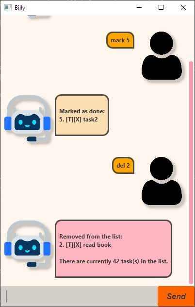

# Billy User Guide

Billy is a desktop app chat bot that will help you keep track of your tasks of various complexity.

## To get your own billy,
1. Ensure you have Java 17 or above installed in your Computer by running `java -version` command on your terminal
2. Download it from [HERE](https://github.com/cyhni/ip/releases/)
3. Copy the jar file into an empty folder
4. Open a command window in that folder
5. Run the command `java -jar "billy.jar"`

## Command Summary

| Command Syntax                                                           | Alternative Syntax                                                   | Description                                                |
|--------------------------------------------------------------------------|----------------------------------------------------------------------|------------------------------------------------------------|
| `list`                                                                   | `l`                                                                  | List tasks                                                 |
| `mark <task num>`                                                        | `m <task num>`                                                       | Mark task as done                                          |
| `unmark <task num>`                                                      | `um <task num>`                                                      | Mark task as undone                                        |
| `todo <task description>`                                                | `t <task description>`                                               | Adds a todo task                                           |
| `deadline <task description> /by <dd-MM-yyyy HHmm>`                      | `d <task description> /by <dd-MM-yyyy HHmm>`                         | Adds a deadline task with a date                           |
| `event <task description> /from <dd-MM-yyyy HHmm> /to <dd-MM-yyyy HHmm>` | `e <task description> /from <dd-MM-yyyy HHmm> /to <dd-MM-yyyy HHmm>` | Adds an event task with a time frame                       |
| `delete <task num>`                                                      | `del <task num>`                                                     | Deletes a task                                             |
| `find <phrase>`                                                          | `f <phrase>`                                                         | Finds the tasks with matching or partially matching phrase |
| `bye`                                                                    |                                                                      | Exits the program                                          |

## Features and Usage

### 1. Listing tasks: `List` 

Format: `list` or `l`

Displays all your available tasks.

### 2. Marking a task as complete: `mark`

Format: `mark <task num>` or `m <task num>`

Example: `mark 4` or `m 4`

Marks the selected task as done in the list with a [x].
- The task number has to be a valid task number
- The task number cannot be left blank

### 3. Unmarking a task: `unmark`

Format: `unmark <task num>` or `um <task num>`

Example: `unmark 4` or `um 4`

Unmarks the selected task as undone in the list with a [ ].
- The task number has to be a valid task number
- The task number cannot be left blank

### 4. Adding a todo task: `todo`

Format: `todo <task description>` or `t <task description>`

Example: `todo do homework` or `t do homework`

Adds a todo task to your list.
- Task description cannot be left blank

### 5. Adding a deadline task: `deadline`

Format: `deadline <task description> /by <dd-MM-yyyy HHmm>` or `d <task description> /by <dd-MM-yyyy HHmm>`

Example: `deadline Week 6 ip increments /by 18-02-2025 2359` or `d Week 6 ip increments /by 18-02-2025 2359`

Adds a deadline task to your list with a specified deadline.
- Fields cannot be left blank
- Date and time must be valid, `18-20-2025 2359` is not a valid date because `20` is not a real month

### 6. Adding an event task: `event`

Format: `event <task description> /from <dd-MM-yyyy HHmm> /to <dd-MM-yyyy HHmm>` or `e <task description> /from <dd-MM-yyyy HHmm> /to <dd-MM-yyyy HHmm>`

Example: `event my birthday /from 01-01-2025 0000 /to 01-01-2026 0000`

Adds a event task to your list with a specified timeframe.
- Fields cannot be left blank
- Date and time must be valid, `18-20-2025 2359` is not a valid date because `20` is not a real month
- Date and time `/from` have to be before `/to` to be valid

### 7. Deleting a task: `delete`

Format: `delete <task num>` or `del <task num>`

Example: `delete 1`

Deletes the specified task.
- The task number has to be a valid task number
- The task number cannot be left blank

### 8. Finding the task(s): `find`

Format: `find <phrase>` or `f <phrase>`

Example: `find project` or `f project`

Finds the tasks with matching or partially matching phrase. 
- `find ta` will return the task `ta` and also `task`

### 9. Exiting the program: `bye`

Format: `bye`

Exits the program. You may also exit the program by closing the window.